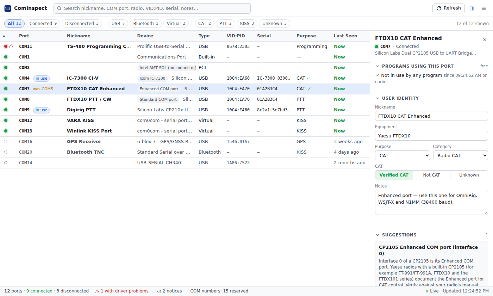
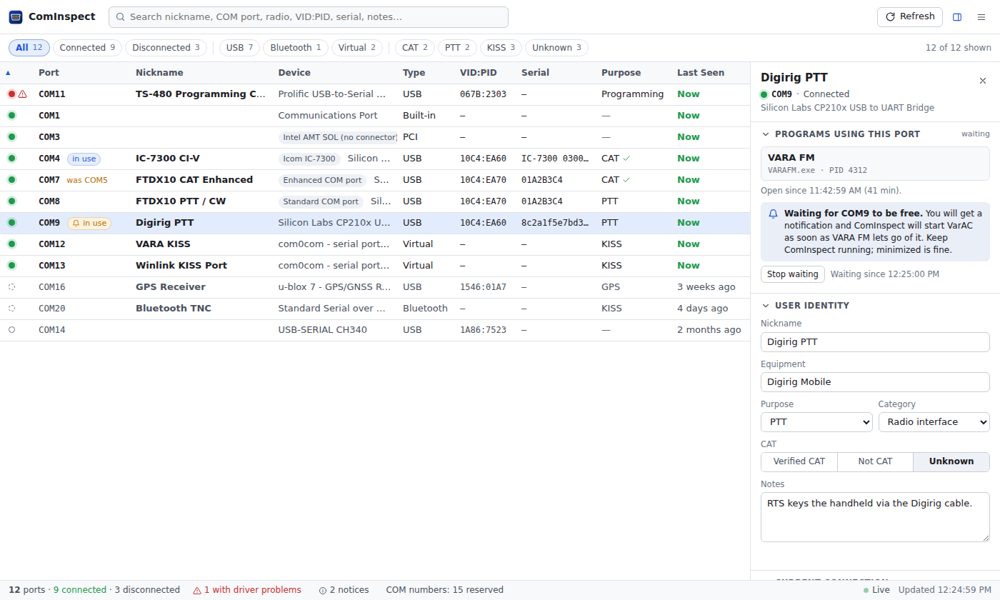
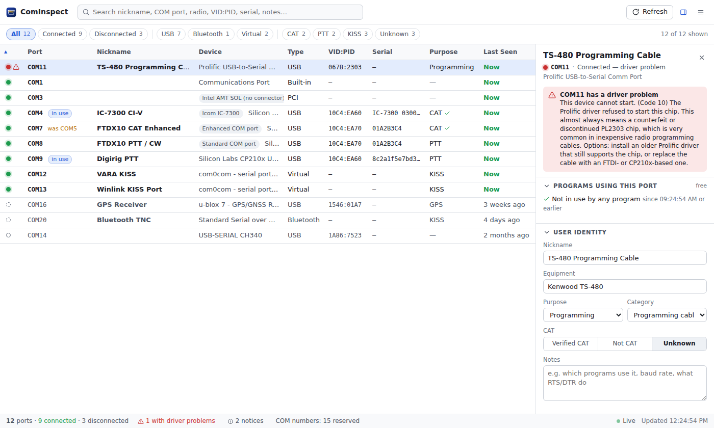
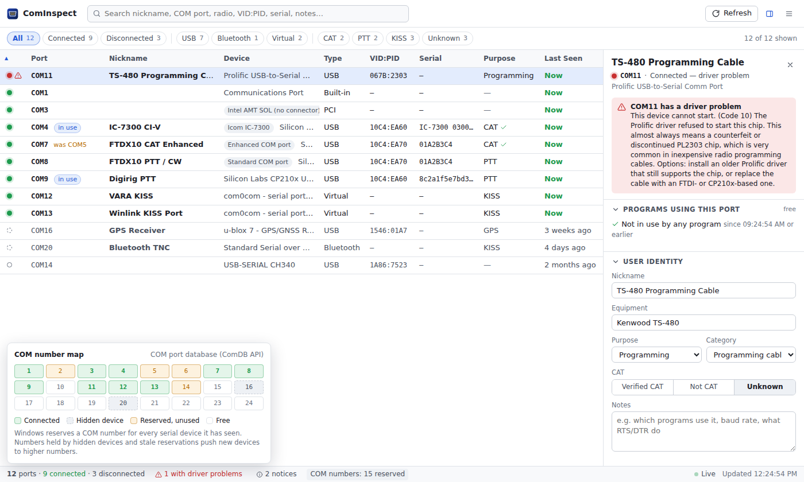
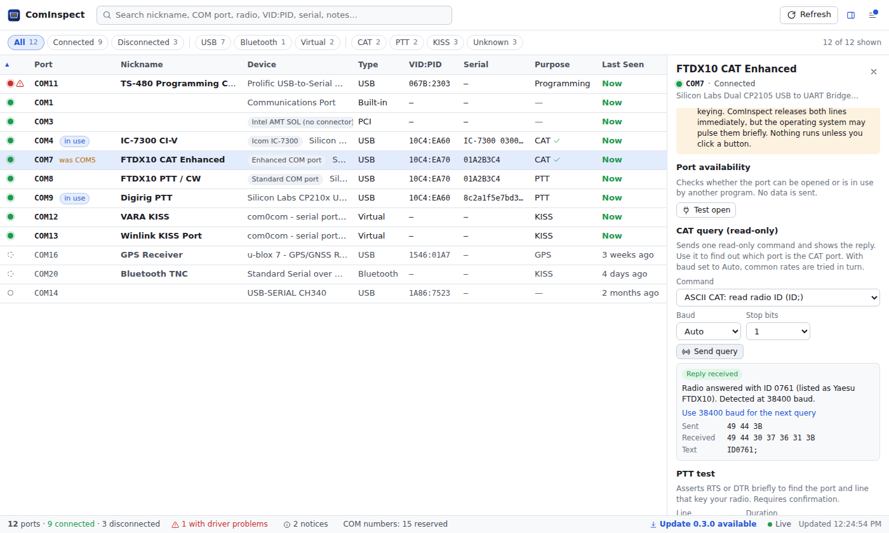
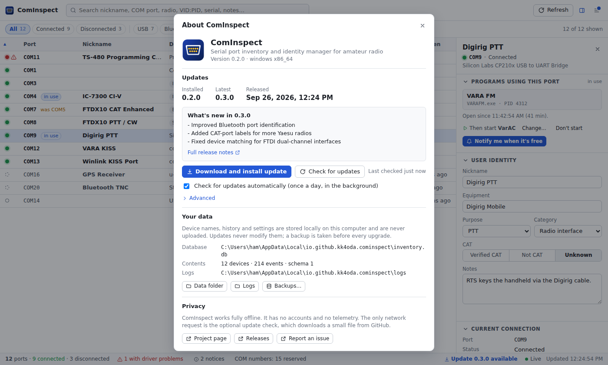

# ComInspect

**Know which serial port is which.** ComInspect is a small desktop app for Windows, Linux and
macOS. It lists every serial (COM) port on your computer and tells you which device each one
belongs to. It also remembers what you use each port for, such as radio CAT control, PTT, CW
keying, a KISS TNC, GPS, a rotator or a programming cable. That record stays correct when the
operating system gives the device a different port number.

<picture>
  <source media="(prefers-color-scheme: dark)" srcset="docs/images/main-dark.png">
  
</picture>

## Why

Radio software asks for a COM port, but a port number doesn't identify a device:

- COM5 can become COM7 when you:
  - plug a cable into a different USB socket
  - reinstall a driver
  - add a second radio
- A radio with a built-in USB interface often shows up as two ports, and only one of them is for
  CAT control.
- Windows keeps COM numbers reserved for devices that were unplugged years ago.

ComInspect tracks the **device** itself, using its USB serial number, Bluetooth address or USB
socket. It then shows which port that device has today.

## Features

- **Every port, with its device.** Covers USB (VID:PID, serial number, interface), Bluetooth,
  virtual ports (com0com, VSPE and others), PCI cards and built-in ports.
- **Persistent identity.** Names and notes follow the device across reconnections, USB sockets and
  COM-number changes. For example, the list shows *COM7 — was COM5*.
- **Hidden Windows ports.** Device Manager lists these only under *Show hidden devices*.
  ComInspect shows:
  - unplugged devices that still hold a COM number
  - reserved and stale COM numbers
  - duplicate assignments
  - driver problems, each explained in plain language (such as the Prolific "Code 10" error)
- **Your own labels.** Each port can have:
  - a nickname and the equipment it connects to
  - a purpose: CAT, secondary CAT, PTT, CW, programming, data, KISS, GPS or control
  - a category and free-form notes

  You can mark a port as *Verified CAT* once you have checked it. ComInspect never assumes a port
  is for CAT.
- **Suggestions, never assumptions.** A built-in device database recognizes common USB-to-serial
  chips and radios with built-in USB. For example, it tells you which of a dual-port bridge's two
  ports is the "Enhanced" one. ComInspect shows suggestions but never applies them for you.
- **Which program has the port.** See which program is using each port, for example *COM4 — in
  use by VARA FM*, without ComInspect opening it. Ask to be notified when the port is free, and
  optionally have ComInspect start the next program, such as VarAC, the moment it is.
- **Live updates.** The list changes as soon as you plug in or remove a device.
- **Search and filters.** Filter by connected, disconnected, USB, Bluetooth, virtual, CAT, PTT,
  KISS or unknown. You can also search across names, hardware IDs and notes.
- **Safe diagnostics, only when you ask.** You can:
  - test that a port opens, and read its incoming control lines
  - send one read-only CAT query, with automatic baud-rate detection
  - run a short PTT test after confirming it

  ComInspect never opens a port on its own.
- **Move to another computer.** Export your port mappings to `serial-port-inventory.json` and import
  them on another computer. Devices with a unique serial number get their names there as soon as
  they are plugged in.
- **Signed automatic updates.** Updates come from a stable channel, with an opt-in beta. A backup is
  taken before every upgrade, and you can reinstall the previous version.
- **Private.** There is no account and no telemetry. The only network access is the optional update
  check.

<table>
  <tr>
    <td colspan="2"></td>
  </tr>
  <tr>
    <td></td>
    <td></td>
  </tr>
  <tr>
    <td></td>
    <td></td>
  </tr>
</table>

*The screenshots use ComInspect's built-in demo data.*

## Install

Download the latest version from the
[Releases page](https://github.com/KK4ODA/ComInspect/releases/latest).

| System | File | Notes |
|---|---|---|
| Windows 10 or 11, 64-bit | `ComInspect_<version>_x64-setup.exe` | Installs for the current user; no administrator rights needed. An `.msi` is also provided. |
| macOS 11 or newer | `ComInspect_<version>_aarch64.dmg` (Apple silicon)<br>`ComInspect_<version>_x64.dmg` (Intel) | Open the disk image and drag ComInspect to Applications. |
| Linux, 64-bit | `.AppImage`, `.deb` or `.rpm` | Needs WebKitGTK 4.1, included in Ubuntu 22.04, Debian 12, Fedora 38 and newer. |

**First start of builds without a code-signing certificate.** Unless a release says it is signed,
the operating system will warn you the first time you open ComInspect:

- **Windows:** SmartScreen shows *Windows protected your PC*. Choose **More info**, then **Run
  anyway**.
- **macOS:** macOS reports that it can't check the app for malicious software.
  - macOS 15 or newer: open **System Settings → Privacy & Security** and click **Open Anyway**.
  - Older versions: Control-click the app, choose **Open**, then confirm.
- **Linux (AppImage):** make the file executable (`chmod +x ComInspect_*.AppImage`), then run it.

These warnings don't affect updates. Every update is checked against the project's own signing key
before it is installed.

**Linux serial port permissions.** To open serial ports, your user usually needs to be in the
`dialout` group (on Arch Linux, the `uucp` group). Run `sudo usermod -aG dialout $USER`, then
log out and back in. ComInspect warns you when a port isn't accessible and names the group.

## Updates

- **Checking.** ComInspect checks for updates once a day in the background. You can turn this off
  under **Menu → About & updates**.
- **Installing.** When a new version is available, a dot appears on the menu button. Nothing is
  installed until you click **Download and install update**.
- **Verification.** Every update is verified with the project's signing key before it is installed.
- **Your data.** Device names, history and settings are kept, and a database backup is taken before
  every upgrade.
- **Going back.** If a new version fails to start properly, ComInspect offers to reinstall the
  previous version. You can also do this under **About & updates → Advanced**.
- **Beta channel.** Beta versions are offered only after you opt in under **About & updates →
  Advanced**. Stable users never receive a beta version.

In-app updates work with:

- the Windows installer
- the macOS app
- the Linux AppImage
- the Linux `.deb` and `.rpm` packages (these ask for your password to install)

## Privacy

ComInspect runs entirely on your computer. It has no accounts, analytics or telemetry, and it never
uploads your data.

- **Where your data lives.** Your device list, names, history and settings are stored in one SQLite
  database in your user profile. **Menu → Open data folder** shows where.
- **Network access.** The only connection ComInspect makes is the update check. That check
  downloads a small file from GitHub Releases, and you can turn it off.

## Command-line tool

`cominspect-cli` gives the same discovery and database features without the window. It is useful
for troubleshooting and scripting. Download it from the
[latest release](https://github.com/KK4ODA/ComInspect/releases/latest): pick
`cominspect-cli-<version>-windows-x64.zip`, `-macos-arm64.tar.gz` (Apple silicon),
`-macos-x64.tar.gz` (Intel), `-linux-x64.tar.gz` or `-linux-arm64.tar.gz`, unpack it and run it
from a terminal. You can also build it from source (see [Development](docs/DEVELOPMENT.md)).

```
cominspect-cli list               # every serial port, with details (never opens a port)
cominspect-cli who                # which programs are using each port (never opens a port)
cominspect-cli wait-free COM4 --then "C:\VarAC\VarAC.exe"   # start VarAC once COM4 is free
cominspect-cli watch              # print arrivals and removals as they happen
cominspect-cli inventory          # the app's device list, with your names
cominspect-cli export --out FILE  # export port mappings
cominspect-cli cat COM7 --protocol kenwood-id   # one read-only CAT query (auto baud)
```

Run `cominspect-cli` with no arguments to see all commands and options. On macOS, a downloaded copy
is quarantined; allow it with `xattr -d com.apple.quarantine cominspect-cli`.

## Documentation

- [User guide](docs/USER_GUIDE.md): naming ports, finding the CAT port, hidden ports and COM
  numbers, diagnostics, export and import, backups and troubleshooting
- [Architecture](docs/ARCHITECTURE.md): how discovery and device identity work on each operating
  system, the database and the update system
- [Development](docs/DEVELOPMENT.md): building from source, project layout and tests
- [Releasing](docs/RELEASING.md): one-time signing setup and how to publish a version
- [Changelog](CHANGELOG.md)

## Status

ComInspect is an early preview (version 0.2). Windows 10 and 11 are the main platforms, and Linux
and macOS are supported too. Please report problems and devices that ComInspect doesn't recognize
on the [issue tracker](https://github.com/KK4ODA/ComInspect/issues). To help, attach the output of
`cominspect-cli list --json` or the log file (**Menu → Open log folder**).

## License

ComInspect is free software under the [MIT License](LICENSE).
